# Web Framework Testing<br />mit Vue.js, Jest (Vitest) & Cypress

## Über mich

<ul>
	<li><strong>Manuel Kübler, B.Sc.</strong></li>
	<li>Full-Stack-Entwickler</li>
	<li>Studium AI Master (2. Semester)</li>
	<li>Ehrenamt:
		<ul>
			<li>Fachschaft I & N</li>
			<li>Studienbeirat I & N</li>
		</ul>
	</li>
	<li>Kontakt:
		<ul>
			<li>kuebler.manuel@fh-swf.de</li></li>
			<li>github.com/softwaredesign-solution</li>
		</ul>
	</li>
</ul>


## Agenda

<ol>
	<li>Grundlagen</li>
	<li>Unit Tests</li>
	<li>Einführung in Cypress</li>
	<li>Integration & Component Tests</li>
	<li>End-to-End (E2E) Tests</li>
</ol>


## Grundlagen

### Warum sollte man Tests schreiben?

<ul>
	<li>Tests stellen sicher, was heute funktioniert wird auch morgen funktionieren</li>
	<li>Tests sorgen langfristig für Stabilität & hohe Qualität</li>
	<li>Manuelle Tests testen nur den Happy-Path, aber nicht die Fehler- & Sonderfälle, Edge cases</li>
</ul>

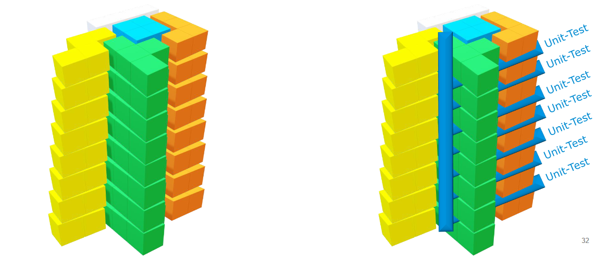
<small>(Quelle: Vertiefung Software Engineering LE4 S.32, Prof. Dr. Doga Arinir)</small>

### Welche Tests gibt es?
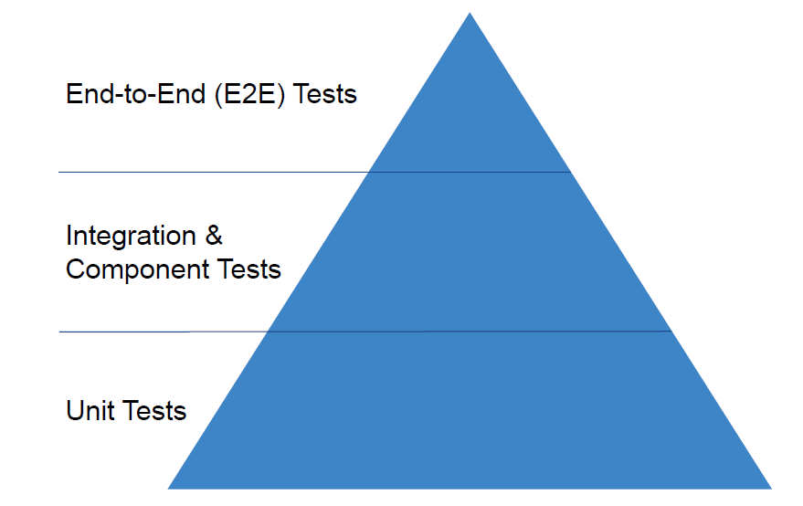
<small>(Quelle: Angular Testing Workshop, Rainer Hahnekamp)</small>

### Wie ist ein Test aufgebaut?

| Funktion         | Beschreibung                                                          |
| ---------------- | --------------------------------------------------------------------- |
| describe()       | Definiert eine Sammlung von Tests                                     |
| beforeAll()      | Wird nur einmal vor allen Tests ausgeführt                            |
| beforeEach()     | Wird vor jedem Test ausgeführt                                        |
| it() bzw. test() | Der eigentliche Test                                                  |
| expect()         | Wertet in Verbindung mit einem Matcher (z.B. toBe()) das Ergebnis aus |
| afterEach()      | Wird nach jedem Test ausgeführt                                       |


### Reihenfolge

```typescript
describe('Tests', () => {
	beforeAll(() => console.log('1 - beforeAll'));
	afterAll(() => console.log('1 - afterAll'));
	beforeEach(() => console.log('1 - beforeEach'));
	afterEach(() => console.log('1 - afterEach'));

	test('', () => console.log('1 - test'));

	describe('Scoped / Nested block', () => {
		beforeAll(() => console.log('2 - beforeAll'));
		afterAll(() => console.log('2 - afterAll'));
		beforeEach(() => console.log('2 - beforeEach'));
		afterEach(() => console.log('2 - afterEach'));

		test('', () => console.log('2 - test'));
	});
});
```

<ol>
	<li>1 - beforeAll</li>
	<li>1 - beforeEach</li>
	<li>1 - test</li>
	<li>1 - afterEach</li>
	<li>2 - beforeAll</li>
	<li>1 - beforeEach</li>
	<li>2 - beforeEach</li>
	<li>2 - test</li>
	<li>2 - afterEach</li>
	<li>1 - afterEach</li>
	<li>2 - afterAll</li>
	<li>1 - afterAll</li>
</ol>


### AAA-Pattern

<ul>
	<li>Industrie-Standard</li>
	<li>
		Aufbau:
		<ul>
			<li>Arrange = Die Umgebung vorbereiten</li>
			<li>Act = Die zu testende Aktion ausführen</li>
			<li>Assert = Ergebnis auswerten</li>
		</ul>
	</li>
	<li>Ausnahmen:
		<ul>
			<li>Die zu testende Funktion liefert eine Exception</li>
		</ul>
	</li>
</ul>

### Ergebnis auswerten

| Matcher                            | Beschreibung                                             |
| ---------------------------------- | -------------------------------------------------------- |
| toBe                               | Ergebnis mit dem übergebenen Wert übereinstimmt          |
| toEqual                            | Prüft, ob die beiden Strukturen übereinstimmen           |
| toBeTruthy/toBeFalsy               | Prüft, ob das Ergebnis true bzw. false ist               |
| toBeDefined/toBeUndefined/toBeNull | Prüft, ob das Ergebnis undefined bzw. null ist           |
| toThrow/toThrowError               | Prüft, ob die zu testende Aktion ein Fehler geworfen hat |
<small>(Quelle: https://jestjs.io/docs/expect)</small>

## Unit Tests

<ul>
	<li>Testet Funktionen/Services</li>
	<li>Äußere Abhängigkeiten werden gemockt</li>
	<li>Dateiendung: spec.ts</li>
</ul>

### Mocking von Abhängigkeiten

```typescript
vi.mock('axios');

// Arrange
const mockedAxios = vi.mocked(axios.get).mockResolvedValue({
	data: [
		{
			id: 'Aufgabe_1',
			name: 'Aufgabe 1',
			description: 'Dies ist eine Aufgabenbeschreibung',
			completed: true
		}
	],
	status: 200,
	statusText: 'OK'
});

const taskService: TaskService = new TaskService();

// Act
const tasks: Task[] = await taskService.getTasks();

// Assert
expect(tasks.length).toBe(1);
expect(tasks[0].name).toBe('Aufgabe 1');

vi.resetAllMocks();
```

## Einführung in Cypress

### Was ist überhaupt Cypress?

<ul>
	<li>Frontend Testing Framework der nächsten Generation</li>
	<li>Open-Source-Community-Projekt</li>
	<li>
		Fast, easy and reliable testing for anything that runs in a browser
		<br/>
		<small>(Quelle: cypress.io)</small>
	</li>
	<li>Cypress wartet selbstständig bis der gewünschte Zustand eingetreten ist</li>
	<li>Screenshots & Video-Recordings</li>
	<li>Dateiendung: cy.ts</li>
	<li>Frontend-Framework: Angular, Next, Nuxt, React, Svelte, Vue</li>
	<li>Bundler: Vite, Webpack</li>
</ul>

### Cypress installieren & konfigurieren

```
npm install cypress --save-dev
```

```
npx cypress open
```

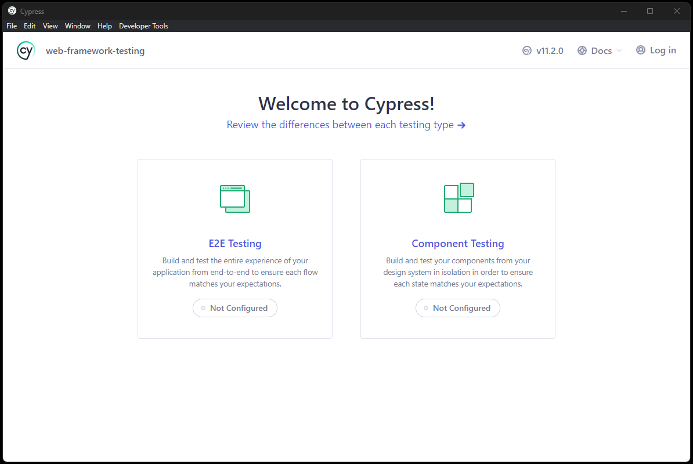

### Grundlegende Funktionen von Cypress

<table>
	<thead>
		<tr>
			<th>Funktion</th>
			<th>Beschreibung</th>
		</tr>
	</thead>
	<tbody>
		<tr>
			<td>visit</td>
			<td>Aufruf der übergenen URL</td>
		</tr>
		<tr>
			<td>get</td>
			<td>auf DOM-Elemente zugreifen</td>
		</tr>
		<tr>
			<td>find</td>
			<td>Ähnlich wie get, kann in der Chain mit anderen Funktionen verwendet werden</td>
		</tr>
		<tr>
			<td>click/type</td>
			<td>Interaktion mit DOM-Elementen</td>
		</tr>
		<tr>
			<td>submit</td>
			<td>Löst das submit-Funktion einer Form aus</td>
		</tr>
		<tr>
			<td>should</td>
			<td>Ergebnis auswerten</td>
		</tr>
		<tr>
			<td>screenshot</td>
			<td>Erstellt einen Screenshot</td>
		</tr>
	</tbody>
</table>

### Mocking von HTTP-Requests

<ul>
	<li>Manipulation von bestimmten HTTP-Anfragen</li>
	<li>Elegante Lösung um Edge Cases zu testen</li>
	<li>HTTP-Antworten können mit fixture-Dateien manipuliert werden</li>
</ul>

### tasks.json

```json
[
	{
		"id": "Aufgabe_1",
		"name": "Aufgabe 1",
		"description": "Dies ist eine Aufgabenbeschreibung",
		"completed": true
	},
	{
		"id": "Aufgabe_2",
		"name": "Aufgabe 2",
		"description": "Dies ist eine Aufgabenbeschreibung",
		"completed": false
	}
]
```

### Code-Beispiel

```typescript
// Liefert eine leere Liste zurück
cy.intercept('GET', 'http://localhost:3000/tasks', []).as('tasks');

// Liefert das Ergebnis aus der fixture-Datei tasks.json zurück
cy.intercept('GET', 'http://localhost:3000/tasks', { fixture: 'tasks.json' }).as('tasks');
```

### Integration & Component Tests

<ul>
	<li>
		Integration Tests:
		<ul>
			<li>Zusammenschluss von mehreren Unit Tests</li>
			<li>HTTP-Requests werden gemockt</li>
		</ul>
	</li>
	<li>Component Tests:
		<ul>
			<li>Komponente wird einer geschlossenen Umgebung getestet</li>
			<li>Abhängigkeiten (HTTP-Requests) werden gemockt</li>
			<li>Werte werden über Parameter übergeben</li>
		</ul>
	</li>
</ul>

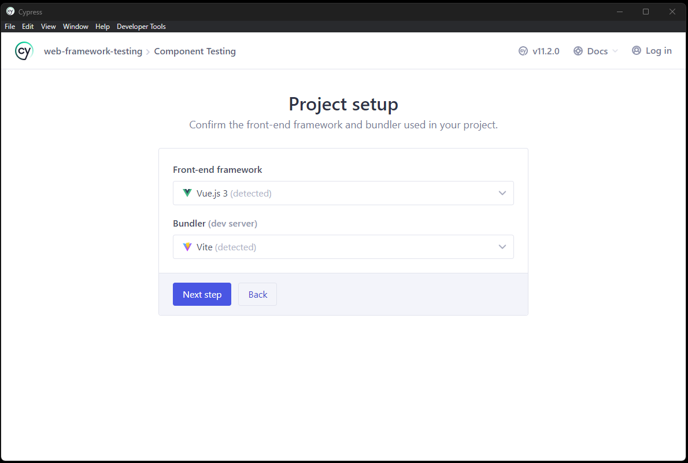

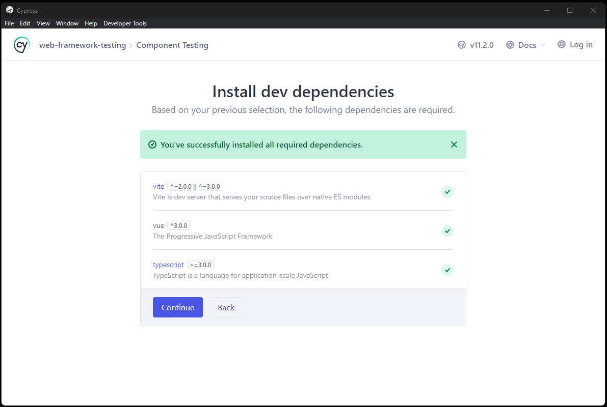

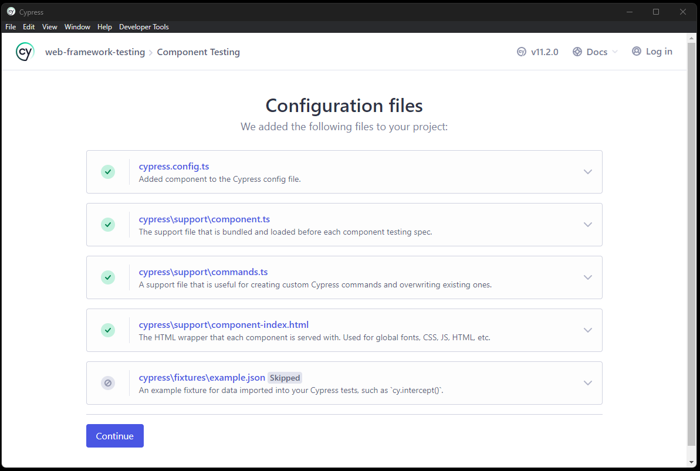

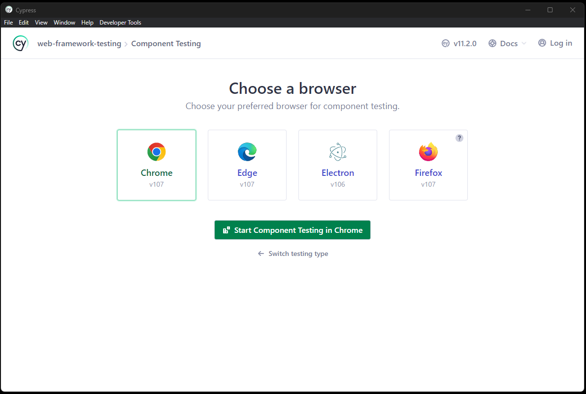

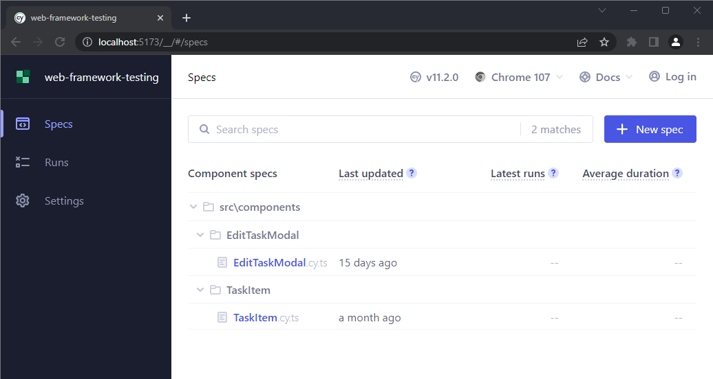

## Beispiel

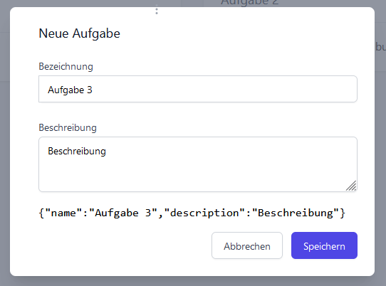

## Code-Beispiel

```typescript
import EditTaskModal from './EditTaskModal.vue';
import type Task from "@/models/Task";

describe('EditTaskModal', () => {

	it('mounted', () => {

		const task: Task = {
			id: 'Hello World!',
			name: 'Hello World!',
			description: 'This task is created with Cypress'
		};

		const onSaveTaskSpy = cy.spy().as('onSaveTaskSpy');

		cy.mount(EditTaskModal, {
			props: {
				onSaveTask: onSaveTaskSpy
			}
		});

		cy.get('#name').type('Hello World!');

		cy.get('#description').type('This task is created with Cypress');

		cy.get('form').submit();

		cy.get('@onSaveTaskSpy').should('have.been.calledWith', task);

	})
})
```

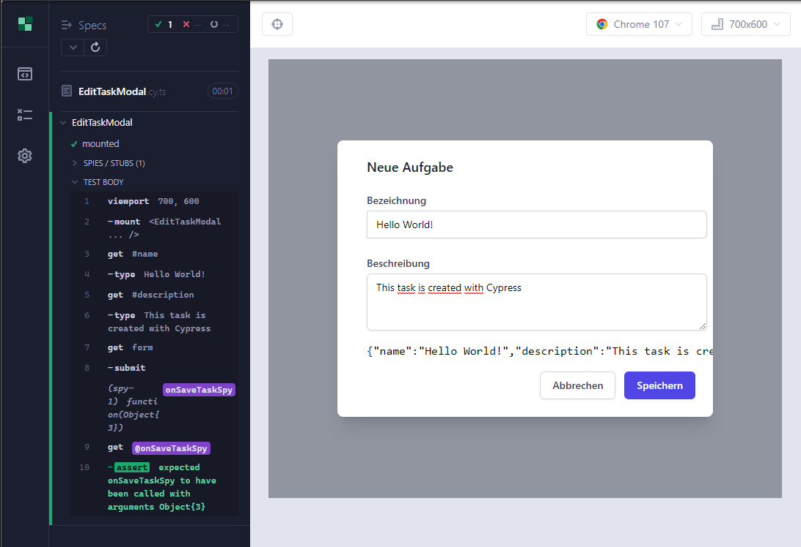


## End-to-End (E2E) Tests

- Gesamte Anwendung wird getestet
- Reale HTTP-Requests, können aber auch gemockt werden
- Die Anwendung muss gestartet sein


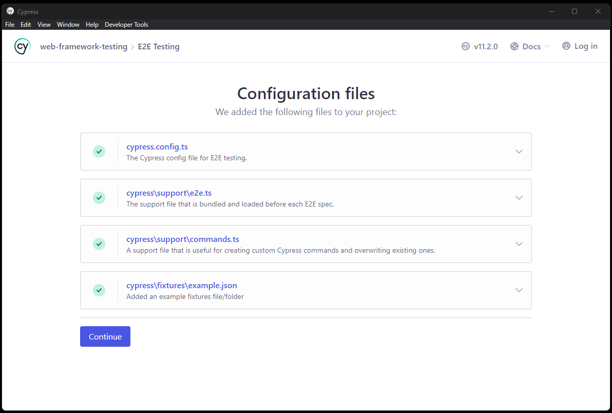

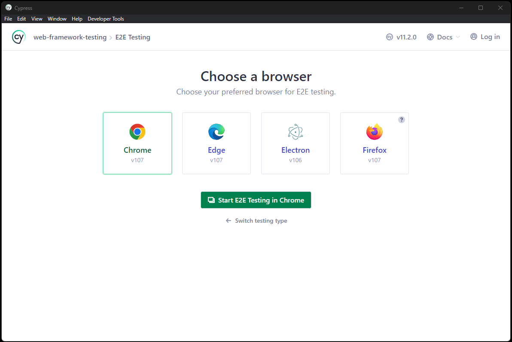

## Beispiel
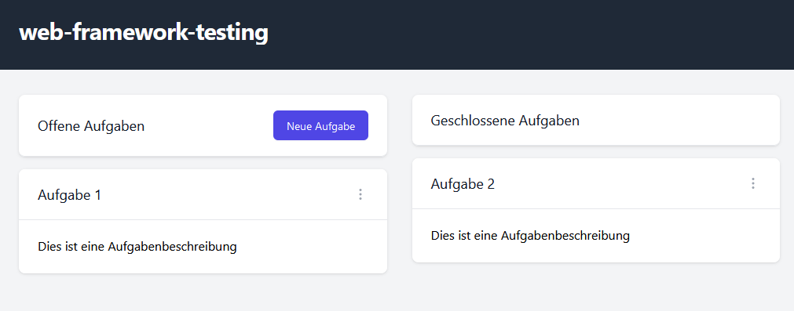

## Code-Beispiel
```typescript
describe('e2e', () => {

	it ('test', () => {

		// Webanwendung aufrufen
		cy.visit('/');

		// Prüfen, ob die Webanwendung vollständig geladen wurde
		cy.contains('h2.app-title', 'web-framework-testing');

		// Schaltfläche "Neue Aufgabe" klicken
		cy.get('#newTask').click();

		// Formular befüllen
		cy.get('#name').type('Hello World!');
		cy.get('#description').type('This task is created with Cypress');

		// Formular abschicken
		cy.get('form').submit();

		// Prüfen, ob die neue Aufgabe mit der eingegebenen Beschreibung in der Liste erscheint
		cy.get('p').contains('This task is created with Cypress').should('have.text', 'This task is created with Cypress');

		// Bei Aufgabe 2 das Kontextmenü öffnen und den Menüpunkt löschen anklicken
		cy.get('#aufgabe_2').then((element) => {
            cy.wrap(element).find('button.menu-options').click();
            cy.wrap(element).find('a.deleteTask').click();
        });

		// Prüfen, ob die Aufgabe gelöscht wurde
		cy.get('#aufgabe_2').should('not.exist');

	});

});
```


